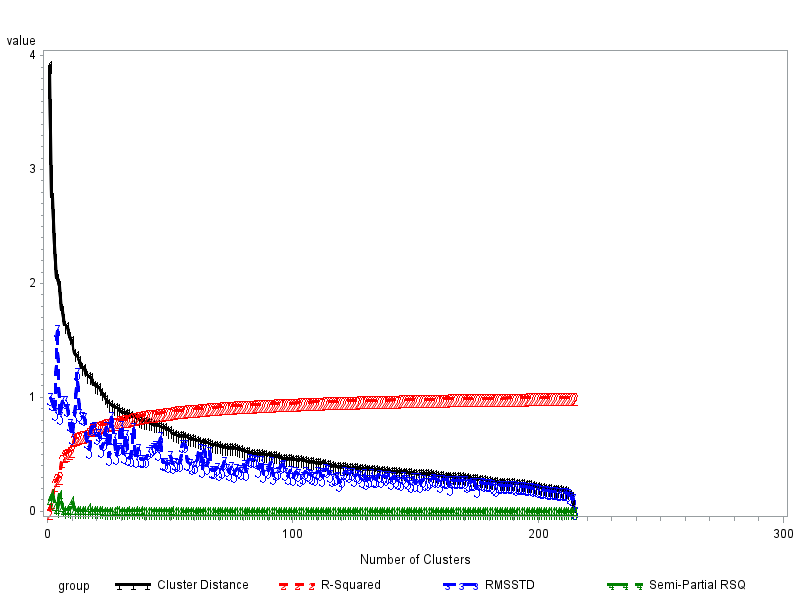

1. Think about what metrics are appropriate for your data based on data type. Write a few sentences about this. Also think about whether you should standardize or transform your data (comment as appropriate).

    ```{R, echo=F, eval=T}
    setwd("~/Documents/S&DS 563/HW3")
    library(knitr)
    library(pander)
    knitr::opts_chunk$set(fig.align="center")
    # https://archive.ics.uci.edu/ml/datasets/chronic_kidney_disease
    ```

    ```{R}
    library(RWeka)
    CKD <- read.arff("../Chronic_Kidney_Disease/chronic_kidney_disease_full.arff")
    # Only Numeric Variables
    CKD.numeric <- CKD[,c(1:2,10:18)]
    # Remove Missing Observations
    CKD.numeric <- CKD.numeric[complete.cases(CKD.numeric),]

    # get standard deviation for each patient
    round(sqrt(apply(CKD.numeric,2,var)),2) %>% pander
    CKD.Norm <- scale(CKD.numeric)
    ```

    There are 213 observations with 11 dimensions in our data. All of the parameters are continuous variables.Because these measurements could be plotted as scatter plots, we could simply measure the distances between the pairs of points by Euclidean distance.There are 213 observations with 11 dimensions in our data. All of the parameters are continuous variables, and scaled parameters have either negative or positive values.Because these measurements could be plotted as scatter plots, we could simply measure the distances between the pairs of points by Euclidean distance. We also tried another metric:the Maxium Distance. 

2. Try various forms of hierarchical cluster analysis. Try at least two different metrics and two agglomeration methods. Produce dendrograms and comment on what you observe.

    ```{R, fig.width=6, fig.height=4}
    K <- 3
    ```

    **Method 1: Euclidean distance**

    ```{R, fig.width=6, fig.height=3.5}
    library(cluster)
    library(vegan)
    library(aplpack)
    library(fpc)
    library(ape)
    library(dplyr)
    library(foreach)
    library(dendextend)
    
    # Euclidean distance | Get the distance matrix
    dist <- dist(CKD.Norm, method="euclidean")

    vis.method.hierarchical.cluster <- function(dist, agglomerations=c("ward.D", "ward.D2")){
        methods <- c("ward.D", "complete", "average", "mcquitty", "median", "centroid", "ward.D2")
        CKD.dendlist <- foreach(method=methods, .combine=dendlist) %do% {
            hclust(dist, method=method) %>% as.dendrogram
        }
        names(CKD.dendlist) <- methods

        CKD.dendlist_cor <- cor.dendlist(CKD.dendlist)
        corrplot::corrplot(CKD.dendlist_cor, "pie", "lower")
        plot.new()

        CKD.dendlist %>%
            dendlist(which = names(CKD.dendlist) %in% agglomerations) %>%
            ladderize %>% 
            set("branches_k_color", k=K) %>% 
            tanglegram(faster = TRUE)
    }

    vis.method.hierarchical.cluster(dist, agglomerations=c("ward.D", "complete"))
    ```

    From the above correlation pie figure, we can easily see that different clustering methods yield very distinct correlation.Here we could compare Ward’s method that minimizing internal sum of squares and complete linkage.

    From the above dendrograms We see that the two algorithms perform quite different for all of the three clusters. The following analysis compares which performs better.


    ```{R, fig.width=6, fig.height=4}
    vis.hierarchical.cluster <- function(dist, agglomeration="average"){
        # Clustering;
        clust <- hclust(dist, method=agglomeration)

        # draw the dendrogram
        #plot(clust, labels=row.names(CKD.numeric), cex=0.5, xlab="", ylab="Distance", main="Clustering for Patients")
        #rect.hclust(clust, k=K)
        #plot.new()
        #plot.new()
        # Get membership vector
        cuts <- stats::cutree(clust, k=K)

        # Make plot of three cluster solution in space desginated by first two principal components
        clusplot(CKD.Norm, cuts, color=TRUE, shade=TRUE, labels=2, lines=0,main=paste("Three Cluster Plot,", agglomeration, "Method First two PC"))
        plot.new()

        # Make plot of three cluster solution in space desginated by first two discriminant functions
        plotcluster(CKD.Norm, cuts, main=paste("Three Cluster Solution in DA Space via the method:", agglomeration),  xlab="First Discriminant Function", ylab="Second Discriminant Function")
    }

    vis.hierarchical.cluster(dist, agglomeration="ward.D")
    vis.hierarchical.cluster(dist, agglomeration="complete")
    ```


    From the above component and discriminant plot, we could see that the Ward’s method did a much better clustering than the complete linkage. 

    **Method 2: Jaccard Distance**

    ```{R, fig.width=6, fig.height=3.5}
    # Maximum distance | Get the distance matrix
    dist2 <- dist(CKD.Norm, method="maximum")

    vis.method.hierarchical.cluster(dist2, agglomerations=c("ward.D", "complete"))
    ```

    The Maximum produce very similar results for different agglomerations. Still we compare the Ward’s method and the complete linkage here. These two methods vary a lot in the clustering.

    ```{R, fig.width=6, fig.height=4}
    vis.hierarchical.cluster(dist2, agglomeration="ward.D")
    vis.hierarchical.cluster(dist2, agglomeration="complete")
    ```

    The Ward’s method seems to cluster different types of patients better than the complete linkage. In addition, the Euclidean distances seems to cluster better than the Maximum distance based on the discrimant plot.  
    Thus, we used the below heatmap to see how those clusters display differences in each patient when we use the Euclidean distance.

    ```{r}
    library(d3heatmap)
    clust <- hclust(dist, method="ward.D")
    dend <- as.dendrogram(clust)
    dend <- rotate(dend, 1:213)
    d3heatmap::d3heatmap(as.matrix(CKD.Norm),
              dendrogram = "row",
              Rowv = dend,
              colors = "Greens",
              # scale = "row",
              width = 600,
              show_grid = FALSE)
    ```

    The rows are ordered based on the order of the hierarchical clustering (using the "ward" method). The colored bar indicates which category each patient belongs to. The color from light green to dark green indicates how the distacne of the patients in each measurement. We can see that some patients are quite diffferent from others in bu(blood urea),  sc(serum creatinine), and sod(sodium), but overall the distinction between each patient is very hard to observe. That might be the reason why different clutering methods would get quite different results.

3. If possible, run the SAS macro to think about how many groups you want to retain. If you can’t run this, discuss how many groups you think are present.
   
    See SAS code

    ```{r, out.width="70%", fig.cap="", echo=F, fig.align="center", fig.pos="H"}
    
    ```


    ```{R}
    #Evaluate Number of Clusters
    source("http://reuningscherer.net/stat660/R/HClusEval.R.txt")
    hclus_eval(CKD.Norm, dist_m='euclidean', clus_m='ward', plot_op=T)
    ```

From the output in SAS and R, we see cluster distance drops when the number of clusters increases.R-squared inreaces with larger number of clusters. Semi-partial RSQ and RMSSTD influctuate. Since we prefer R-squared near 1, and smaller cluster distance, semi-partial RSQ and RMSSTD, We choose to retain 3 groups.


    ```{R, fig.width=6, fig.height=4}
    library("NbClust")
    nb <- NbClust(CKD.Norm, distance="euclidean", min.nc=2, max.nc=10, method="kmeans")

    library("factoextra")
    fviz_nbclust(nb)
    ```
Also, the above frequency distribution shows that three clusters are proposed most. 


4. Run k-means clustering on your data. Compare results to what you got in 3. Include a sum of squares vs. k plot and comment on how many groups exist.
    
    ```{r, fig.width=6, fig.height=4}
    # Modified Script by Matt Peeples http://www.mattpeeples.net/kmeans.html
    #   Produces screeplot like diagram with randomized comparison based
    #   on randomization within columns (i.e. as if points had been randomly assigned
    #   data values, one from each column.  Keeps total internal SS the same.

    #kdata is just normalized input dataset
    kdata=CKD.Norm
    n.lev=20  #set max value for k

    # Calculate the within groups sum of squared error (SSE) for the number of cluster solutions selected by the user
    wss <- rnorm(10)
    while (prod(wss==sort(wss,decreasing=T))==0) {
      wss <- (nrow(kdata)-1)*sum(apply(kdata,2,var))
      for (i in 2:n.lev) wss[i] <- sum(kmeans(kdata, centers=i)$withinss)}

    # Calculate the within groups SSE for 250 randomized data sets (based on the original input data)
    k.rand <- function(x){
      km.rand <- matrix(sample(x),dim(x)[1],dim(x)[2])
      rand.wss <- as.matrix(dim(x)[1]-1)*sum(apply(km.rand,2,var))
      for (i in 2:n.lev) rand.wss[i] <- sum(kmeans(km.rand, centers=i)$withinss)
      rand.wss <- as.matrix(rand.wss)
      return(rand.wss)
    }

    rand.mat <- matrix(0,n.lev,250)

    k.1 <- function(x) { 
      for (i in 1:250) {
        r.mat <- as.matrix(suppressWarnings(k.rand(kdata)))
        rand.mat[,i] <- r.mat}
      return(rand.mat)
    }

    # Same function as above for data with < 3 column variables
    k.2.rand <- function(x){
      rand.mat <- matrix(0,n.lev,250)
      km.rand <- matrix(sample(x),dim(x)[1],dim(x)[2])
      rand.wss <- as.matrix(dim(x)[1]-1)*sum(apply(km.rand,2,var))
      for (i in 2:n.lev) rand.wss[i] <- sum(kmeans(km.rand, centers=i)$withinss)
      rand.wss <- as.matrix(rand.wss)
      return(rand.wss)
    }

    k.2 <- function(x){
      for (i in 1:250) {
        r.1 <- k.2.rand(kdata)
        rand.mat[,i] <- r.1}
      return(rand.mat)
    }

    # Determine if the data data table has > or < 3 variables and call appropriate function above
    if (dim(kdata)[2] == 2) { rand.mat <- k.2(kdata) } else { rand.mat <- k.1(kdata) }

    # Plot within groups SSE against all tested cluster solutions for actual and randomized data - 1st: Log scale, 2nd: Normal scale

    xrange <- range(1:n.lev)
    yrange <- range(log(rand.mat),log(wss))
    plot(xrange,yrange, type='n', xlab='Cluster Solution', ylab='Log of Within Group SSE', main='Cluster Solutions against Log of SSE')
    for (i in 1:250) lines(log(rand.mat[,i]),type='l',col='red')
    lines(log(wss), type="b", col='blue')
    legend('topright',c('Actual Data', '250 Random Runs'), col=c('blue', 'red'), lty=1)

    yrange <- range(rand.mat,wss)
    plot(xrange,yrange, type='n', xlab="Cluster Solution", ylab="Within Groups SSE", main="Cluster Solutions against SSE")
    for (i in 1:250) lines(rand.mat[,i],type='l',col='red')
    lines(1:n.lev, wss, type="b", col='blue')
    legend('topright',c('Actual Data', '250 Random Runs'), col=c('blue', 'red'), lty=1)
    ```

    The above plots:cluster size vs log of within group SSE and within group SSE, show that within group SSE drops most when there is two clusters.
    
    ```{r, fig.width=6, fig.height=4}

    # Calculate the mean and standard deviation of difference between SSE of actual data and SSE of 250 randomized datasets
    r.sse <- matrix(0,dim(rand.mat)[1],dim(rand.mat)[2])
    wss.1 <- as.matrix(wss)
    for (i in 1:dim(r.sse)[2]) {
      r.temp <- abs(rand.mat[,i]-wss.1[,1])
      r.sse[,i] <- r.temp}
    r.sse.m <- apply(r.sse,1,mean)
    r.sse.sd <- apply(r.sse,1,sd)
    r.sse.plus <- r.sse.m + r.sse.sd
    r.sse.min <- r.sse.m - r.sse.sd

    # Plot differeince between actual SSE mean SSE from 250 randomized datasets - 1st: Log scale, 2nd: Normal scale 

    xrange <- range(1:n.lev)
    yrange <- range(log(r.sse.plus),log(r.sse.min))
    plot(xrange,yrange, type='n',xlab='Cluster Solution', ylab='Log of SSE - Random SSE', main='Cluster Solustions against (Log of SSE - Random SSE)')
    lines(log(r.sse.m), type="b", col='blue')
    lines(log(r.sse.plus), type='l', col='red')
    lines(log(r.sse.min), type='l', col='red')
    legend('topright',c('SSE - random SSE', 'SD of SSE-random SSE'), col=c('blue', 'red'), lty=1)

    xrange <- range(1:n.lev)
    yrange <- range(r.sse.plus,r.sse.min)
    plot(xrange,yrange, type='n',xlab='Cluster Solution', ylab='SSE - Random SSE', main='Cluster Solutions against (SSE - Random SSE)')
    lines(r.sse.m, type="b", col='blue')
    lines(r.sse.plus, type='l', col='red')
    lines(r.sse.min, type='l', col='red')
    legend('topright',c('SSE - random SSE', 'SD of SSE-random SSE'), col=c('blue', 'red'), lty=1)
    ```

    The above two plots also show that SSE - random SSE reaches plateau after two clusters. Thus the cluster level show be two.
    
    ```{r, fig.width=6, fig.height=4}
    clust.level <- 2
    # Apply K-means cluster solutions - append clusters to CSV file
    fit <- kmeans(kdata, clust.level)
    aggregate(kdata, by=list(fit$cluster), FUN=mean)
    # Display Principal Components plot of data with clusters identified
    clusplot(kdata, fit$cluster, shade=F, labels=2, lines=0, color=T, lty=4, main='Principal Components plot showing K-means clusters')

    #Make plot of Two cluster solution in space desginated by first two
    #  two discriminant functions
    plotcluster(kdata, fit$cluster, main="Two Cluster Solution in DA Space", xlab="First Discriminant Function", ylab="Second Discriminant Function")
    ```

    The K-means method shows that there are two clusters for the patients. 
   
    ```{r}
     # try cluster size=3
    fit <- kmeans(kdata,3)
    aggregate(kdata, by=list(fit$cluster), FUN=mean)
    # Display Principal Components plot of data with clusters identified
    clusplot(kdata, fit$cluster, shade=F, labels=2, lines=0, color=T, lty=4, main='Principal Components plot showing K-means clusters')

    #Make plot of Two cluster solution in space desginated by first two
    #  two discriminant functions
    plotcluster(kdata, fit$cluster, main="Two Cluster Solution in DA Space", xlab="First Discriminant Function", ylab="Second Discriminant Function")
    ```

    When there are three clusters, the clusterig produced by K means and hierachical clustering are very similar.


5. Comment on the number of groups that seem to be present based on what you find above.


